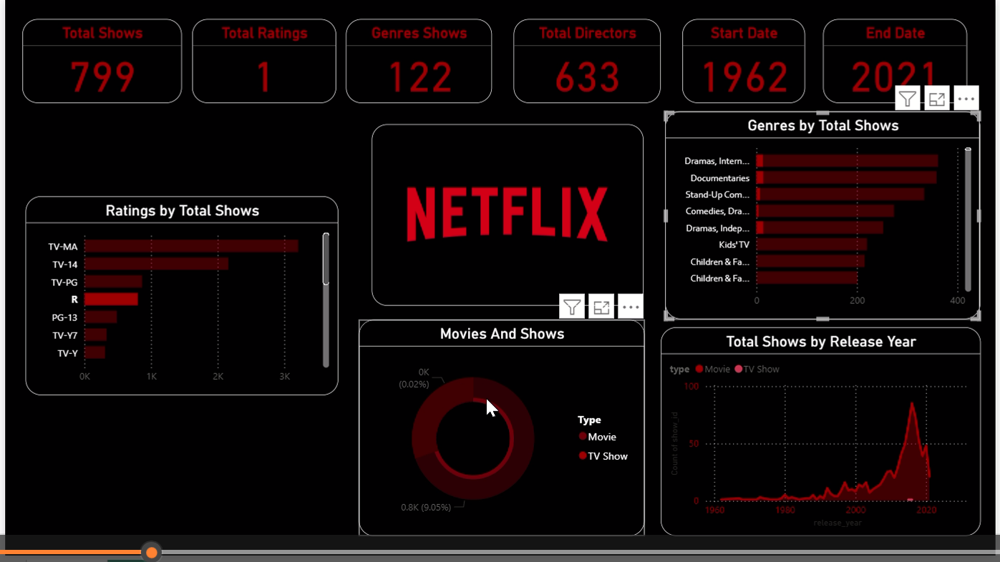

# 🎬 What Keeps Netflix Viewers Hooked? — Subscription & Behavior Analysis


**8,500 subscribers. 5 regions. 3 tiers. The data knows exactly who stays, who leaves, and what they watched before they did.**

Netflix doesn't just stream content — it manages a massive retention machine. This project reverse-engineers that machine using real subscription and behavior data to uncover what actually drives engagement, upgrades, and churn.

---

## 📸 Dashboard Preview



---

## 🍿 The Story Behind the Data

Streaming platforms live and die by one number: **how long do you keep people subscribed?**

This analysis digs into 8,500 user records to answer the questions Netflix's own data team obsesses over — what content keeps people watching, when do they cancel, and which tier gives the most value to both user and platform.

| 🎬 | |
|---|---|
| **Dataset** | 8,500 Netflix subscriber records |
| **Scope** | 3 subscription tiers · 5 regions · 12-month window |
| **Tools** | Python (Pandas, Matplotlib) · SQL · Power BI · Excel |
| **Angle** | Content strategy + subscription optimization |

---

## 🔦 Spotlight: What the Data Revealed

### 🆓 The Free Tier Problem
The Free tier isn't just less profitable — it's actively churning at an alarming rate.

> SQL cohort analysis revealed **22% higher churn** in Free-tier users vs paid tiers.
> Peak drop-off happens within the **first 30 days** — before users even discover their favourite content.

### 🌍 Regional Content Preferences
Not all genres travel equally. Python-powered mapping of viewing behavior across 5 regions showed that:
- Top genres vary significantly by region — what works in one market flops in another
- Peak viewing hours differ by up to 4 hours across regions — affecting recommendation timing

### 📅 The 12-Month Arc
Subscriber growth isn't linear. Trend analysis revealed seasonal spikes, content-driven surges, and quiet months — giving a clear picture of when to push upgrade campaigns.

---

## 💡 The Recommendations

| 🎯 Insight | 💼 Business Action |
|---|---|
| 22% higher Free-tier churn | Target upgrade campaigns at day 14 and day 25 |
| First 30 days = highest drop-off | Improve onboarding with personalised content picks |
| Regional genre preferences vary | Localise content recommendations by region |
| Peak viewing hours differ | Optimise notification timing per region |
| **Projected retention uplift** | **10–15% improvement across tiers** |

---

## 📊 The Dashboard

```
🔢 KPI Cards      → Total Subscribers · Revenue · Avg Retention · Churn Rate
📈 Growth Trend   → 12-month subscriber growth by tier
🌍 Region View    → Top genres & engagement rates by region
💰 Tier Analysis  → Revenue & retention breakdown — Free vs Basic vs Premium
📉 Churn Signals  → Drop-off timing and risk indicators
🔘 Filters        → Region · Subscription Tier · Month
```

---

## 🧪 How It Was Built

**Step 1 — SQL deep dive**
Joined subscription, viewing, and churn tables to build a complete picture of each user's journey. Cross-tier cohort comparisons surfaced the 22% churn gap.

**Step 2 — Python behavioral mapping**
Pandas + Matplotlib mapped viewing patterns across 12 months — peak hours, genre preferences, and binge vs casual viewing segments.

**Step 3 — Dashboard for decisions**
Power BI dashboard designed for a content strategy team — not just charts, but actionable views that answer "what should we do next?"

---

## 📁 Repository Structure

```
├── 📓 netflix_analysis.ipynb      # Python analysis — viewing behavior & trends
├── 📊 netflix_dashboard.pbix      # Power BI dashboard
├── 📗 netflix_data.xlsx           # Cleaned dataset
├── 🖼️ dashboard_preview.png       # Dashboard screenshot
└── 📄 README.md
```

---

## 🛠️ Tools Used & Why

| Tool | Why it was the right choice |
|---|---|
| 🗄️ **SQL** | Cohort joins across 3 tables — essential for tier comparison |
| 🐍 **Python** | Matplotlib made 12-month trend arcs instantly readable |
| 📊 **Power BI** | Regional drill-down needed interactive filtering |
| 📗 **Excel** | Quick tier-by-tier revenue sanity checks |

---

## 👩‍💻 About

**Sri Lakshmi Harshitha Nandivada**
📊 Data Analyst | 🎓 MBA Finance | 📍 Hyderabad | ✈️ Open to Relocation

[](https://linkedin.com/in/harshitha-nandivada)
[](https://github.com/HarshiDataWorld)

---

⭐ *If this analysis made you think differently about streaming data — drop a star!*

*🗂️ See also: [🎹 Piano Platform Dashboard](https://github.com/HarshiDataWorld) · [🔄 Customer Churn Analysis](https://github.com/HarshiDataWorld/Bank-Customers-Churn-Analysis)*
